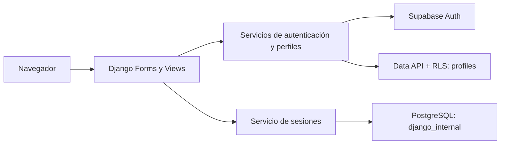

# Arquitectura de Plan B

US1 y US2 incorporan registro e inicio de sesión mediante Supabase Auth y un
dashboard con grupos. Django renderiza la interfaz y coordina servicios; PostgreSQL
almacena perfiles e infraestructura de sesión con responsabilidades separadas.

| Componente | Responsabilidad |
| --- | --- |
| `config/` | Configuración compartida, ejecución PostgreSQL y tests SQLite. |
| `apps/users/forms.py` | Validar entradas y política canónica de contraseña. |
| `apps/users/views.py` | Flujo HTTP y mensajes seguros; no llamadas HTTP al proveedor. |
| `apps/users/services/` | Clientes efímeros, Auth, perfiles, tokens y errores controlados. |
| `apps/users/models.py` | Únicamente `SupabaseSession`, un modelo técnico. |
| `supabase/migrations/` | DDL, grants, RLS y trigger de perfil junto al alta Auth. |

Supabase es la única autoridad de identidad. El perfil no duplica email ni
contraseña. Django conserva sesiones, mensajes, archivos estáticos y CSRF,
pero no instala `auth`, `admin` ni `contenttypes`. La conexión `DB_*` se limita
a infraestructura; los perfiles se consultan mediante Data API. Los componentes
del bootstrap ya migrados no se borran de una base existente.

Esta entrega no incluye edición de perfil, recuperación/cambio de contraseña,
OAuth, invitaciones, propuestas, preferencias ni algoritmo de compatibilidad.

## Decisiones y guías

- [Autenticación con Supabase](autenticacion-supabase.md): privilegios, clientes,
  confirmación, login, logout y configuración manual de passwords.
- [Esquema de datos](esquema-datos.md): constraints, grants, RLS, sesiones,
  aislamiento del esquema y orden de migraciones.
- [Validación](../testing/autenticacion.md): suite offline y límites de mocks/SQLite.

La suite offline no aplica SQL ni modifica infraestructura remota. Las pruebas
reales de correo, Auth, RLS y concurrencia PostgreSQL se ejecutan únicamente en
un entorno de prueba preparado y autorizado por el equipo.

## Grupos

`apps/groups` agrega creación, detalle y lectura de pertenencias al dashboard.
Reutiliza clientes efímeros y JWT del usuario. La RPC `public.create_group`
persiste grupo y owner en una transacción de Supabase; el ORM sigue limitado
a infraestructura. Ver [pruebas y despliegue](../testing/grupos.md).
